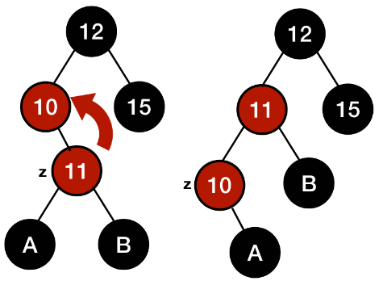

# Красно-черное дерево

1. Каждый узел промаркирован красным или чёрным цветом
2. Корень и конечные узлы (листья) дерева — чёрные
3. У красного узла родительский узел — чёрный
4. Все простые пути из любого узла x до листьев содержат одинаковое количество чёрных узлов
Чёрный узел может иметь чёрного родителя

## Повороты
### Левый поворот
